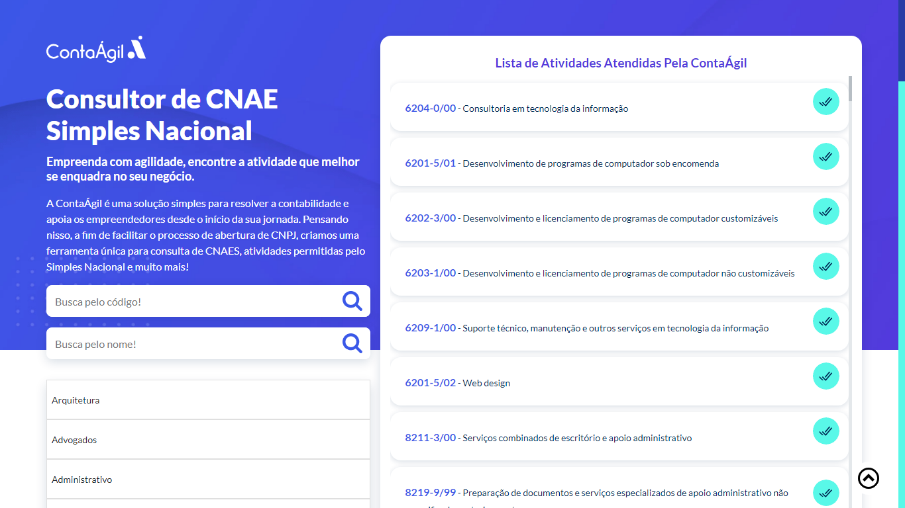

<h1 align="center"> Ferramenta de Busca de CNAES - Versão 1.0 </h1>

Essa Ferramenta foi criada para ajudar, os usuários a encontrar um melhor cnae que atenda a sua atividade.

  <a href="#-tecnologias">Tecnologias</a>&nbsp;&nbsp;&nbsp;|&nbsp;&nbsp;&nbsp;
  <a href="#-projeto">Projeto</a>&nbsp;&nbsp;&nbsp;|&nbsp;&nbsp;&nbsp;
  <a href="#-layout">Layout</a>&nbsp;&nbsp;&nbsp;|&nbsp;&nbsp;&nbsp;
  <a href="#memo-licença">Licença</a>

  

 

  

## 🚀 Tecnologias

Esse projeto foi desenvolvido com as seguintes tecnologias:

- PHP
- API's
- Integração com RD-STATION
- HTML e CSS
- JavaScript
- Git e Github
- Adobe XD

## 💻 Projeto

O Buscador de CNAES é uma ferramenta que ao fazer a busca por um termo, ela retorna toda informação de um determinado CNAE.

Nessa ferramenta foram consumidas duas API's uma do IBGE oficial e outra prorietária da ContaÁgil

EXEMPLO:
Ao digitar o código 6204-0/00 ele retorna um array com todas informações referente a essa cnae.

## :memo: Licença

Esse projeto está sob a licença MIT.

---

Feito com ♥ by Vanderlei
